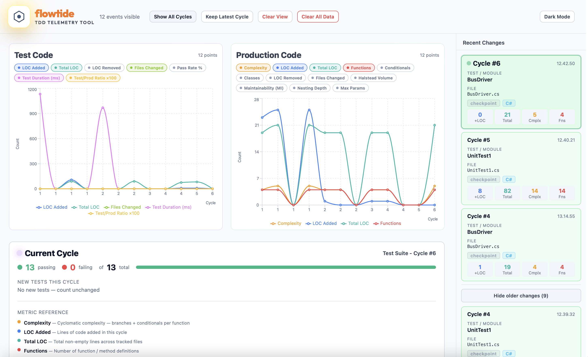
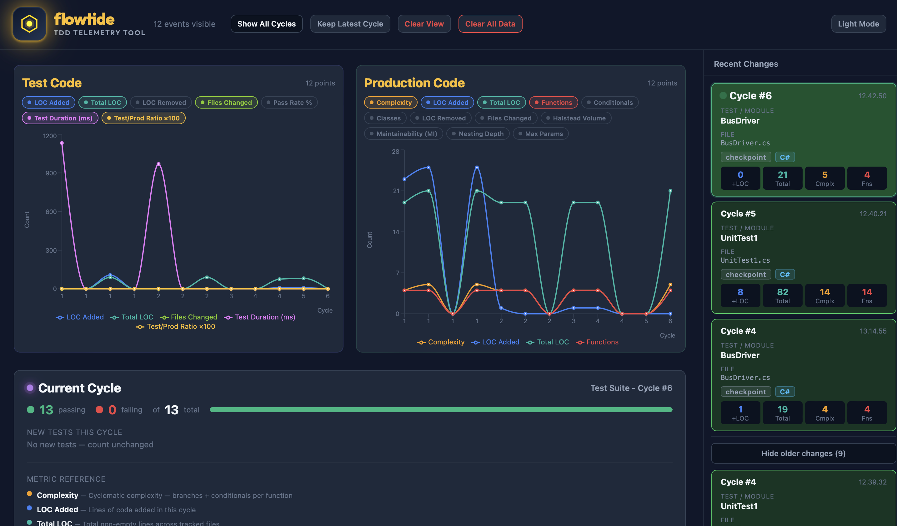
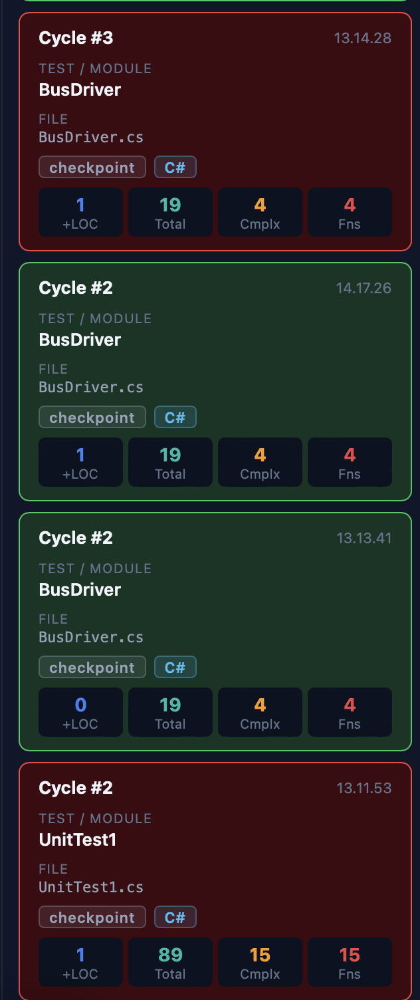

# Flowtide

Flowtide is a TDD telemetry tool that watches a codebase, analyzes source changes, runs that codebase's tests, and streams live metrics into a React dashboard.



The app is split into:

- `backend/` - watches files, analyzes changes, runs tests, stores events in SQLite, and publishes updates over WebSocket
- `frontend/` - renders the live dashboard with charts, recent cycles, pass/fail state, and summary data

## Basic Requirements

Install these before using the app:

- Node.js 18+ recommended
- npm 9+ recommended
- A supported project to watch, with its own language toolchain and test runner installed

Flowtide itself does not require a separate SQLite install. It uses `better-sqlite3` and creates its own local database file automatically.

## Supported Project Types

Flowtide can detect and run tests for projects that use these ecosystems:

- .NET: `dotnet test`
- Java Maven: `mvn test`
- Java Gradle: `gradle test` or `./gradlew test`
- Node.js: Jest, Vitest, or Mocha projects
- Python: `pytest`
- Rust: `cargo test`
- Haskell: `stack test` or `cabal test`
- Elm: `elm-test`
- Ruby: RSpec or Minitest
- Swift Package Manager: `swift test`

It also includes source analyzers for these languages:

- TypeScript
- Java
- C#
- Python
- Rust
- Go
- Ruby
- Haskell
- Elm
- Kotlin
- Swift

## Extending Flowtide

Flowtide is now structured so language analysis and test execution support can be extended without editing one large `switch` block.

### Test runner structure

The backend test-runner code is split into these files:

- `backend/src/test-runners/runTests.ts` - stable public entrypoint used by the analyzer
- `backend/src/test-runners/types.ts` - shared `TestRunner`, `DetectedProject`, and `TestRunResult` types
- `backend/src/test-runners/utils.ts` - reusable command execution and filesystem detection helpers
- `backend/src/test-runners/parsers.ts` - output parsers for different test frameworks
- `backend/src/test-runners/runners.ts` - the built-in runner registry and project detection order

The important extension point is `builtInTestRunners` in `backend/src/test-runners/runners.ts`.

Each runner implements:

- `detect(filePath)` - determines whether a changed file belongs to that project type and returns the project root
- `execute(root)` - runs the test command for that project type
- `parse(output)` - turns command output into `{ passed, failed, total }`

The first runner whose `detect()` returns a match wins, so runner order matters.

### How to add a new test runner

To support a new project type or test framework:

1. Add a parser function in `backend/src/test-runners/parsers.ts` if the new tool has a unique output format.
2. Add a new `TestRunner` object in `backend/src/test-runners/runners.ts`.
3. Put the new runner in the correct position inside `builtInTestRunners`.
4. Make sure the required CLI tool is installed on the machine where Flowtide runs.

Example shape:

```ts
{
	kind: "my-runner",
	detect(filePath) {
		const match = findUp(filePath, ["my-tool.config.js"]);
		return match ? { kind: "my-runner", root: match.root } : null;
	},
	execute(root) {
		return execCommand("my-test-cli", ["test", "--reporter=plain"], root);
	},
	parse(output) {
		return parseMyRunner(output);
	},
}
```

If the output format is simple, you can keep the parser inline in the runner instead of adding a new exported parser function.

### How to add a new language adapter

Adding a new language adapter is separate from adding a test runner.

If you want Flowtide to analyze source metrics for a new language:

1. Create a new adapter file in `backend/src/adapters/`.
2. Implement the `LanguageAdapter` interface from `backend/src/adapters/LanguageAdapter.ts`.
3. Add the adapter import and registration entry in `backend/src/registry.ts`.

Your adapter needs to provide:

- `supports(path)` - identifies file extensions or path patterns
- `classify(path)` - returns `"test"` or `"production"`
- `extractTestName(path)` - returns a readable name for the changed test/module
- `extractTests(code)` - returns discovered individual test names
- `analyze(code)` - returns metrics such as functions, conditionals, classes, complexity, and total LOC

### If you add a new language, what files usually change?

For a fully working new language integration, you normally update both of these areas:

- `backend/src/adapters/` and `backend/src/registry.ts` for code analysis support
- `backend/src/test-runners/` for test execution support

In practice:

- If Flowtide can analyze the files but cannot run that project's tests, you will get code metrics but weak or empty pass/fail telemetry.
- If Flowtide can run tests but has no adapter for the file type, test totals may work but source metrics for those files will be missing.

### Recommended workflow for adding support

1. Start by implementing the language adapter so changed files are recognized and classified correctly.
2. Add the test runner so Flowtide can execute the project's test command.
3. Confirm the new runner is ordered correctly in `builtInTestRunners`.
4. Save a file in a sample project and verify that a new cycle appears in the dashboard with both metrics and pass/fail results.

## Install Prerequisites

### 1. Install Node.js and npm

Download and install Node.js from the official site:

- https://nodejs.org/

Verify the installation:

```bash
node -v
npm -v
```

### 2. Install the toolchain for the project you want to watch

Examples:

- .NET projects: install the .NET SDK
- Java projects: install a JDK and Maven or Gradle
- Python projects: install Python and `pytest`
- Rust projects: install Rust and Cargo
- Ruby projects: install Ruby and Bundler
- Elm projects: install Elm and `elm-test`
- Swift projects: install Swift Package Manager support
- Node projects: install the project's npm dependencies and test framework

If the watched project cannot run its tests from the command line, Flowtide will not be able to report accurate pass/fail telemetry for it.

## Install Flowtide Dependencies

From the repository root, install the dependencies for both app parts:

```bash
cd backend
npm install

cd ../frontend
npm install
```

### If you need to remove `node_modules`

Yes, you can safely delete the `node_modules` directories in the repository root, `backend/`, and `frontend/`.

Important:

- `node_modules` only contains installed packages. Deleting it does not remove your source code.
- After deleting it, the app will not run again until dependencies are reinstalled.
- This repository does not use npm workspaces, so `backend/` and `frontend/` must be installed separately.
- The root `node_modules/` is usually not required for normal use of the app, but if you delete it and want the root package dependencies back as well, run `npm install` in the repository root too.

Recommended clean reinstall sequence:

```bash
rm -rf node_modules backend/node_modules frontend/node_modules

cd backend
npm install

cd ../frontend
npm install
```

If you also want to restore the root-level dependencies:

```bash
cd /path/to/telemetry
npm install
```

To ensure installation succeeds on a new machine:

1. Install Node.js first.
2. Run `npm install` inside `backend/`.
3. Run `npm install` inside `frontend/`.
4. Start the backend and frontend using the commands shown below.

If `npm install` fails:

- make sure your Node.js version is modern enough for the packages in this repo
- retry from a clean directory after removing the relevant `node_modules/` folder and `package-lock.json` only if you are intentionally refreshing dependencies
- ensure native packages such as `better-sqlite3` can build on your machine if no prebuilt binary is available

## How To Run The App

You need two terminals (or use a Terminal Multiplexer).

### Terminal 1: Start the backend watcher

From the `backend/` directory, start the watcher and pass the path to the project you want to monitor:

```bash
cd backend
npm run dev -- /absolute/path/to/project-you-want-to-watch
```

Example:

```bash
cd backend
npm run dev -- /Users/me/katas/roman
```

The backend will:

- watch the target path for file additions and changes
- analyze matching source files
- run the target project's tests when changes are processed
- store events in SQLite
- publish updates over WebSocket on port `8080`

### Terminal 2: Start the frontend dashboard

From the `frontend/` directory:

```bash
cd frontend
npm run dev
```

Vite will start the frontend, usually at:

```text
http://localhost:5173
```

Open that URL in your browser.

## How To Use Flowtide

1. Start the backend and point it at the project you want to monitor.
2. Start the frontend.
3. Open the dashboard in your browser.
4. Edit or add files inside the watched project.
5. Save changes.
6. Flowtide will detect the change, run analysis, run tests, and update the dashboard.

## Dashboard Views

Flowtide supports both light and dark themes and keeps the same telemetry layout in each mode.

### Light Theme


### Dark Theme



## What You Will See

The dashboard shows:

- separate charts for test code and production code, each with selectable metric series
- cycle-by-cycle metrics for all tracked dimensions (toggle any on or off per chart)
- test pass/fail totals for the latest cycle
- newly discovered tests for the latest cycle
- a recent changes panel with highlighted current cycle state
- persisted history restored on refresh

### Pass / Fail Cycles View

The cycle list highlights passing and failing runs so regressions are easy to spot while you work.



### Tracked Metrics

Each chart supports the following metrics. The first four are visible by default; the rest can be toggled on using the pill buttons above each chart.

| Metric | Default | Description |
|---|---|---|
| Complexity | On | Cyclomatic complexity (branches + conditionals) |
| LOC Added | On | Lines of code added in this cycle |
| Total LOC | On | Total non-empty lines currently in tracked files |
| Functions | On | Number of function or method definitions |
| Conditionals | Off | Number of `if`, `else if`, `when`, `switch`, or guard expressions |
| Classes | Off | Number of class, struct, enum, or type definitions |
| LOC Removed | Off | Lines of code deleted in this cycle |
| Files Changed | Off | Number of distinct files modified in this cycle |
| Pass Rate % | Off | Percentage of tests passing (0–100) |
| Halstead Volume | Off | Computational volume: `N × log₂(n)` where N = total operator/operand tokens, n = distinct vocabulary. Higher volume means more code to read and understand. |
| Maintainability (MI) | Off | Score from 0–100: `max(0, (171 − 5.2·ln(HV) − 0.23·CC − 16.2·ln(LOC)) × 100 / 171)`. Higher is better. Values above 85 are considered highly maintainable. |
| Nesting Depth | Off | Maximum nesting level of control structures (`{`/`}` depth for curly-brace languages; indentation depth for Python, Haskell, and Elm). High depth makes code harder to read. |
| Max Params | Off | Maximum number of parameters across all function/method definitions in the changed files. Functions with many parameters often indicate a design smell. |
| Test Duration (ms) | Off | Wall-clock time in milliseconds for the entire test suite to run. Measured from before the test command is launched to after it exits (includes process startup). Useful for spotting test suite slowdown over time. |
| Test/Prod Ratio ×100 | Off | `(test_loc_total / prod_loc_total) × 100`. A value of 100 means a 1:1 ratio (equal test and production LOC). Healthy projects typically sit between 33 and 100 (1:3 to 1:1). The value is multiplied by 100 so it is visible on the same chart axis as other counts. |

> **Notes:**
> - Pass Rate % is plotted on the same Y-axis as count-based metrics, so it reads as a raw number from 0 to 100.
> - Maintainability Index (MI) is averaged across all changed files in a cycle.
> - Nesting Depth is the maximum across all changed files in a cycle.
> - Max Params is the maximum across all changed files in a cycle.
> - Halstead Volume is summed across all changed files in a cycle.
> - Halstead Volume and Maintainability Index use regex-based operator/operand counting and are reliable approximations across all supported languages.
> - Test Duration (ms) includes process startup time and is best used for tracking trends rather than absolute values.
> - Test/Prod Ratio ×100 is only meaningful when both test and production files are present in the same project.

Metrics are tracked separately for test code and production code. Each chart panel is independent.

### Metrics not tracked (and why)

| Metric | Why not tracked |
|---|---|
| Code Duplication % | Requires comparing all files against each other — not computable from a single changed file in isolation. A dedicated tool like SonarQube or CPD is needed. |
| Class Coupling (Afferent Ce / Efferent Ca) | Afferent coupling (how many classes reference this class) requires a full cross-file dependency graph. Efferent coupling (how many classes this class references) is approximated by import count if needed, but is not tracked by default to avoid redundancy. |

## Data Storage

Flowtide stores telemetry events in a local SQLite database file named `events.db`.

The app also supports clearing stored telemetry from the UI using the `Clear All Data` action.

### Recreating `events.db`

If you delete `events.db`, Flowtide will recreate it automatically the next time the backend starts.

Best way to recreate it:

1. Stop the backend if it is running.
2. Delete `events.db`.
3. Start the backend again from the same directory you normally use, for example:

```bash
cd backend
npm run dev -- /absolute/path/to/your/project
```

On startup, Flowtide will open SQLite, recreate the `events` table, and continue normally. New telemetry rows will appear as soon as file changes are processed.

Notes:

- `events.db` is created relative to the backend process working directory. If you start the backend from `backend/`, the recreated file will normally be `backend/events.db`.
- Deleting the file removes all previously stored telemetry history.
- If you only want to remove telemetry data but keep the database file, use the `Clear All Data` button in the UI instead.

## Notes And Limitations

- The backend expects a real filesystem path as its argument
- The frontend expects the backend WebSocket server on `ws://localhost:8080`
- Only files supported by the registered language adapters will produce source metrics
- Test execution depends on the watched project's own test command and installed toolchain
- Ignored directories include `node_modules`, `target`, `bin`, `obj`, `dist`, and `build`

## Quick Start

```bash
cd backend
npm install
npm run dev -- /absolute/path/to/your/project
```

In another terminal:

```bash
cd frontend
npm install
npm run dev
```

Then open `http://localhost:5173`.